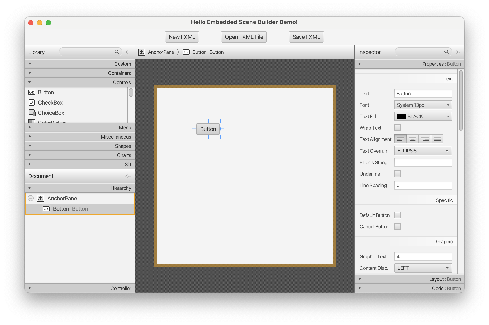

# EmbeddedSceneBuilderDemo

Simple JavaFX demo application that embeds Scene Builder Kit

## Components

### SceneBuilderPane

It is a `StackPane` that holds the Scene Builder Kit integration by adding a `SplitPane` container with three items: 
- to the left, the library section and the document section (that holds hierarchy and controller sections)
- center: the content area
- to the right, the inspector section
in the same way the Scene Builder application does.

### SBController

Holds the operations that can be done in the SceneBuilderPane, namely the handlers of some usual actions:
- Copy, Cut, Paste, Duplicate
- Select all, Select none, Delete
- Undo, Redo
- New FXML, Open FXML, Save FXML

### DependencyScanner

Scans the modulepath/classpath of the application, and finds out all possible custom JavaFX controls, and adds them to the Custom Control section of the library.

### DemoApplication

Simple JavaFX application with the SceneBuilderPane node and some buttons to interact with it.

## Run

Using JDK 21+, to run the application, open a terminal and run the following:

```
git clone https://github.com/gluonhq/EmbeddedSceneBuilderDemo.git
cd EmbeddedSceneBuilderDemo
mvn javafx:run
```


